# Gerenciador de Empresas

Esse projeto foi desenvolvido na base de um projeto simples de MVC. Nele foi desenvolvido um back-end mais robusto e um front-end dinâmico. A base desse projeto foi criada no curso [Java Web: crie aplicações com Servlets e MVC](https://cursos.alura.com.br/formacao-java-web) da [Alura](https://github.com/alura-cursos), a versão base se encontra na branch versao-original-alura. O conteúdo das outras branches já não condiz mais em quase nada com o projeto base. Essa é uma aplicação web de registro de empresas com Java legado, o usuário insere um nome e a data de abertura, pode editar o cadastro e também arquivar.

## 🛠️ Tecnologias utilizadas

- Java 17
- Maven
- Jakarta Servlet
- Jakarta Validation
- JPA / Hibernate
- MySQL / H2 (test)
- Bcrypt
- Junit Jupiter
- Mockito
- Gson
- Lombok
- Expressões Regulares
- JSP
- CSS
- JavaScript (Front-end)

## 🌟 Melhorias

Clique para expandir

### Boas práticas 
- Gerenciamento de dependências com Maven.
- Validação de entradas server-side com Bean Validation.
- Padrões de design: services, repositories e DTOs.
- Testes automatizados de unidade e integração.

### Persistência
- Relacionamento entre objetos.
- Persistência com banco de dados relacional com JPA.
- Paginação de consultas.
- Criptografia de senha.

### Front-End
- Estilização com CSS.
- Páginas dinâmicas com JS.
- Modularização do front-end.
- Validação de formulários client-side.

### Outros
- Reestruturação de pacotes.
- Migração da biblioteca javax-servlet para jakarta-servlet.

## 🧩 Novas funções
- Criar usuário.
- Criar empresa.
- Listar somente empresa do usuário.
- Listar somente empresa ativa ou somente arquivada.
- Editar empresa de forma dinâmica.
- Arquivar empresa de forma dinâmica. 
- Pesquisar por registros empresa.

---

## 🌐 Endpoints

Clique para expandir

 

Os endpoints são baseados principalmente em query params. A URL base é `/gerenciador`, as duas principais rotas são `/empresa` e `/usuario`.

### Parâmetros para rota `/usuario`

#### POST
- `novoUsuario`: Cadastra um novo usuário
- `verificaLogin`: Utilizado pelo formulário de cadastro de usuário para validar se o login está disponível
- `login`: Autentica o usuário

#### GET
- `loginForm`: Retorna a página de formulário de login
- `novoUsuarioForm`: Retorna página de formulário de cadastro de um novo usuário
- `logout`: Invalida a autenticação do usuário

### Parâmetros para rota `/empresa`

#### POST
- `novaEmpresa`: Cadastra uma nova empresa

#### GET
- `search`: Faz uma pesquisa por empresas de acordo com o nome enviado
- `searchAjax`: É utilizado pelo mecanismo de pesquisa do Front-End, onde executa a pesquisa via Ajax para atualizar a página de forma dinâmica
- `listaEmpresas`: Retorna a página com todas as empresas da plataforma
- `listaEmpresasUsuario`: Retorna a página com todas as empresas cadastradas pelo usuário 
- `listaEmpresasUsuarioAtivoAjax`: É utilizado pelo front-end para retornar todas as empresas do usuário de forma dinâmica
- `novaEmpresaForm`: Retorna a página de formulário de cadastro de empresa

#### PUT
- `removeEmpresa`: Arquiva empresa
- `atualizaEmpresa`: Atualiza dados da empresa

## 📱 Telas

### Login
- Antes de enviar o formulário para o servidor é verificado se os campos atendem às regras mínimas dos campos.

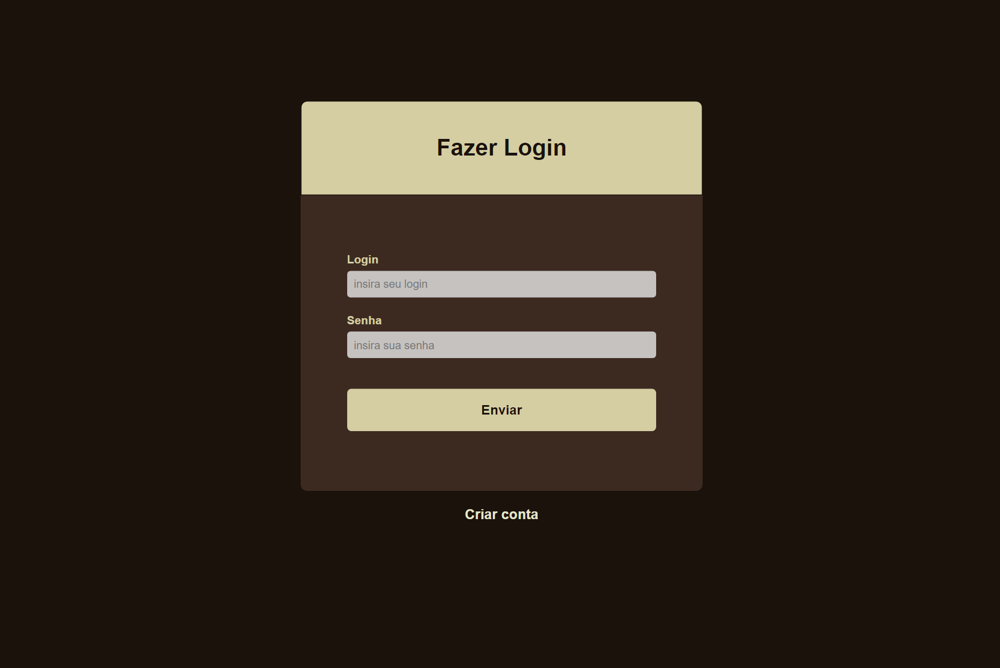
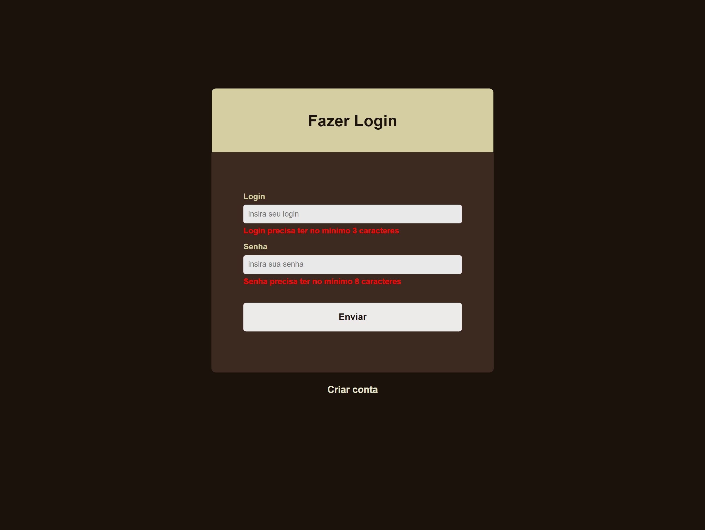

---

### Cadastro de `Usuario`
- Sempre que o formulário é submetido, é disparada uma requisição AJAX que verifica se o login digitado já existe.

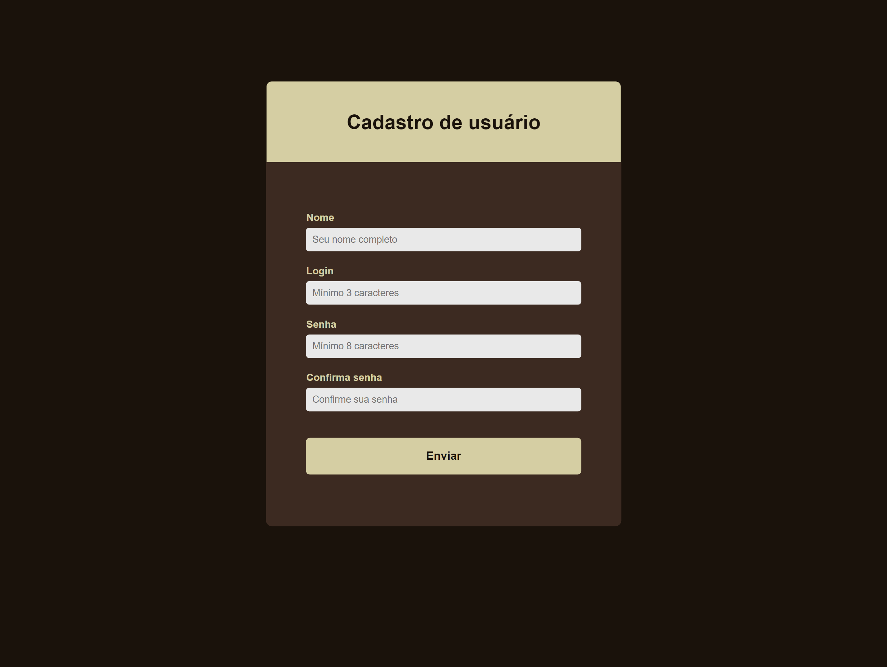
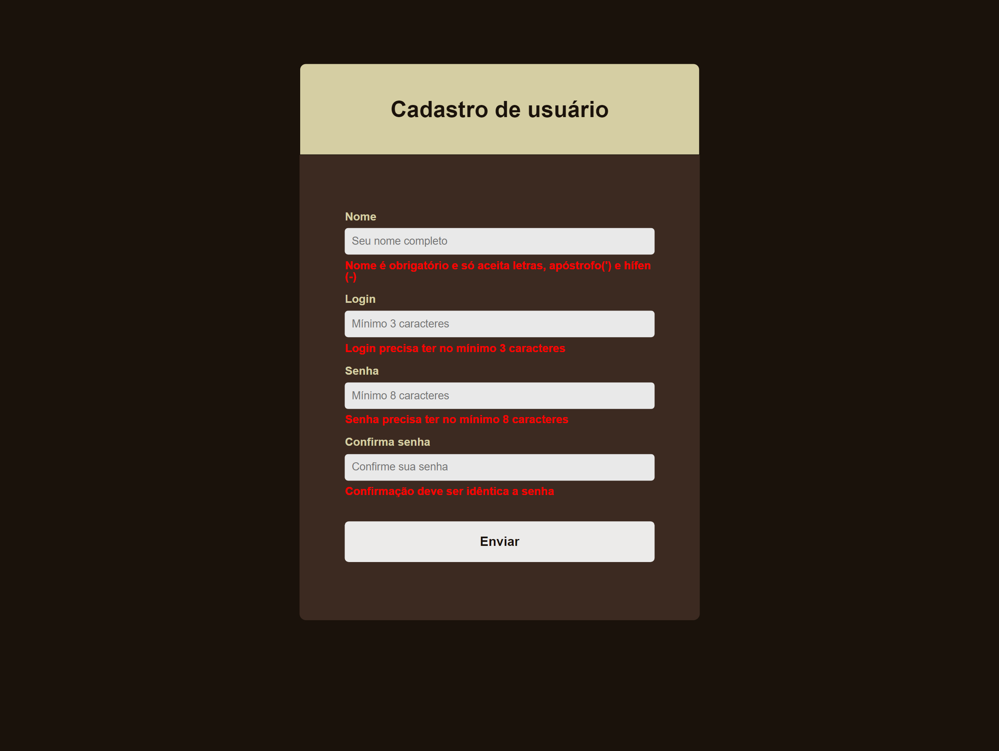
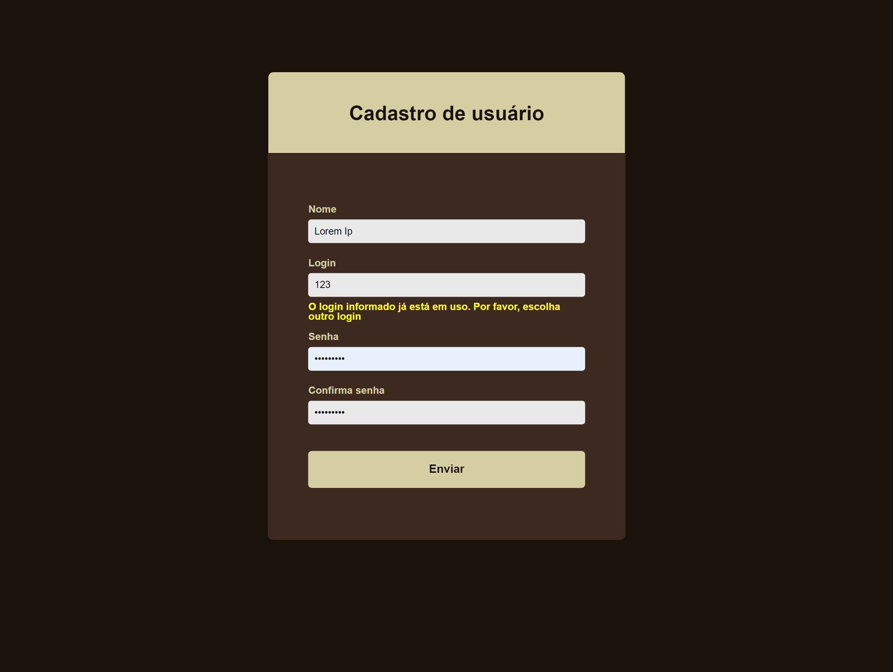

---

### Lista `Empresas` do `Usuario` 
- Os objetos `Empresa` possuem relacionamento com `Usuario`.
- O `Usuario` só pode editar e arquivar empresas relacionadas consigo.
- As remoções são exclusões lógicas, definidas pelo atributo `ativo`.
- Os botões arquivar/desarquivar quando clicados enviam uma requisição assíncrona para o servidor que altera o atributo `ativo` da `Empresa` no banco de dados. Se a requisição for bem-sucedida, o elemento clicado será removido da view.

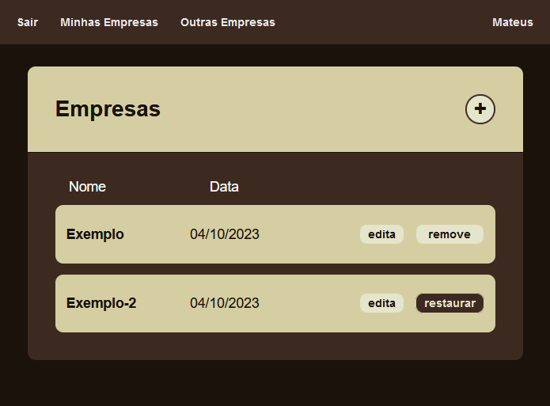
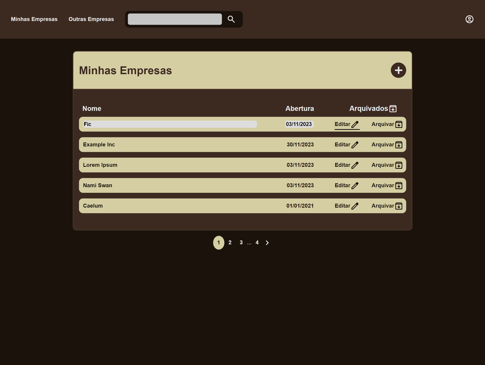
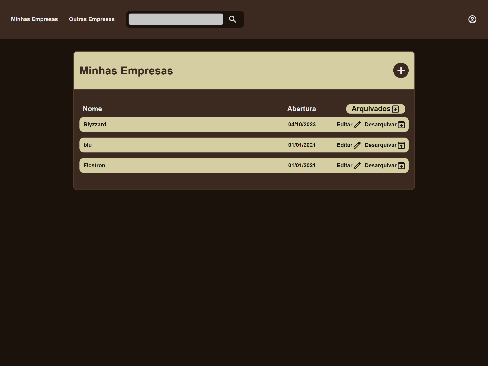

---

### Lista `Empresas`
- Somente empresas com `ativo == true` serão listadas.

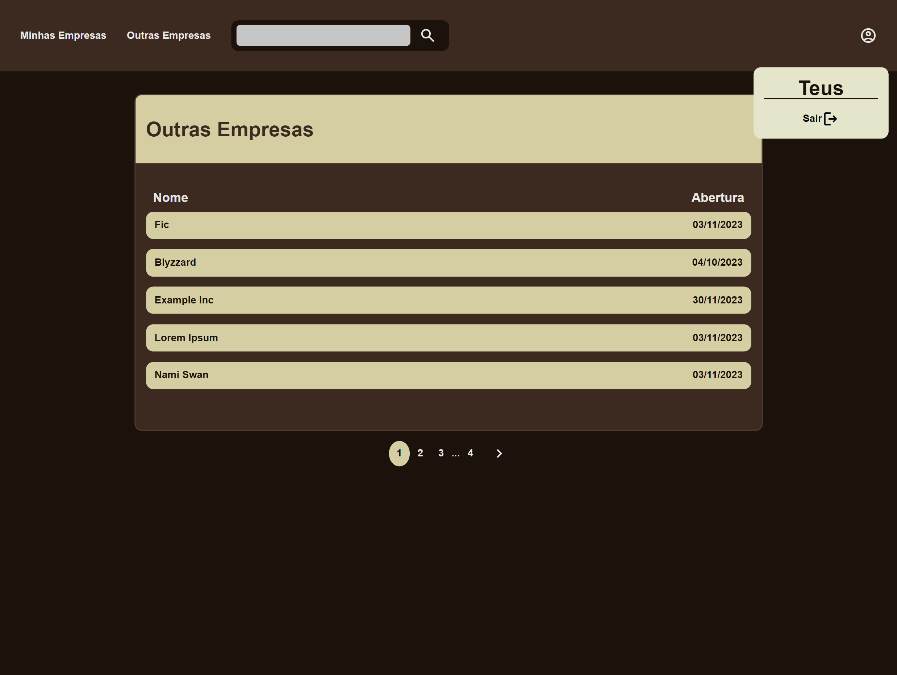

---

### Pesquisa `Empresas`
- Caso nenhum registro seja encontrado, irá aparecer uma mensagem de erro como resultado da pesquisa.
- Somente empresas com atributo `ativo == true` serão recuperadas.

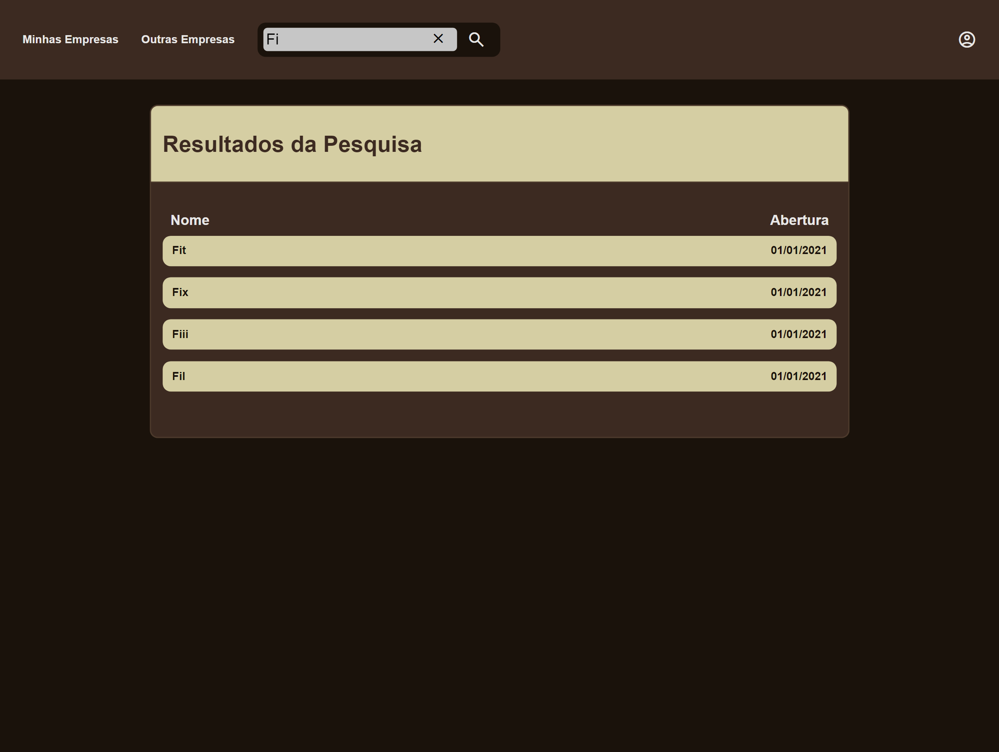
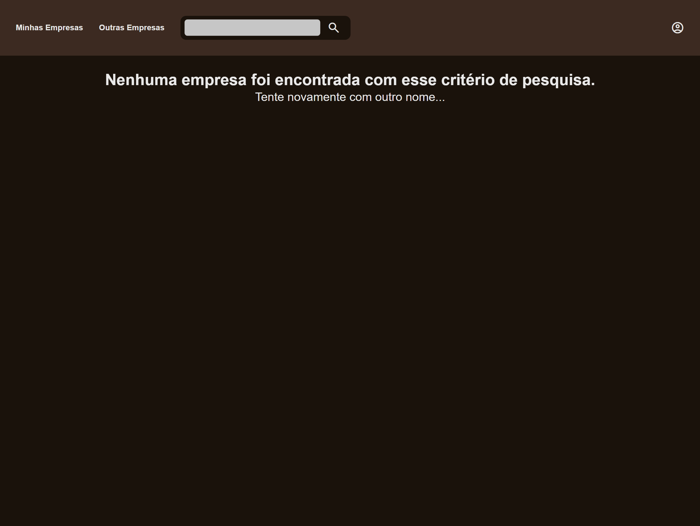

### Tratamento das entradas nos formulários server-side

- Mesmo que o usuário consiga inserir entradas que estão em desacordo com as regras dos campos, são feitas validações com Bean Validation do lado do servidor.

## 🚀 Como Rodar

Clique para expandir

### Pré-requisitos

- Java 17
- Banco de dados MySQL 8.0
- Service Tomcat 10.1

### Instalando

- Clone o projeto: 

        `git clone https://github.com/mtpontes/gerenciador.git`

- Entre no diretório principal do projeto e execute: 
    * Para Linux: 
    
          ./mvnw clean install -DskipTests

    * Para Windows: 
          
          mvnw.cmd clean install -DskipTests

    * Caso já possua Maven instalado: 
    
          mvn clean install -DskipTests

### Detalhes

A aplicação está configurada para se conectar ao MySQL pela porta 3306.

### Variáveis de ambiente:
- `DB_USERNAME`: valor padrão **root**
- `DB_PASSWORD`: valor padrão **root**

##### Essas configurações também podem ser alteradas no `persistence.xml`.

### Deploy
O app empacotado pode ser encontrado no diretório `/target` após seguir o procedimento de instalação.

- Copie o `.war` para o diretório webapp do servidor Tomcat
- Execute o script de inicialização do Tomcat no diretório bin do servidor:
    - Linux: `sudo ./startup.sh`
    - Windows: `startup.bat`

## 💻 Desenvolvimento do projeto

Clique para expandir

 

O Gerenciador é um Web App baseado em query params, os quais utilizada para direcionar o fluxo das requisições.

Esse projeto surgiu como um treinamento para praticar CSS e alguns conceitos de backend. A medida que fui desenvolvendo surgiram novas ideias e foi tomando novas proporções. É meu primeiro projeto de programação, nele tive a primeira vez de muitas coisas, por isso, preferi por não usar frameworks e libs no front-end, para conseguir resolver tudo da maneira mais crua, de forma que exercitasse bastante a minha lógica, criatividade e conhecimento de algorítmos.

## 🧠 Aprendizado

### Tecnologias e libs
- CSS
- JSP
- JavaScript
- Jakarta Persistence API (JPA)
- Bean Validation
- Testes automatizados de unidade com Junit
- Testes automatizados de integração com Junit e H2

### Ferramentas e conceitos consolidados
- Arquitetura MVC
- Validações server-side e client-side
- Manipulação e tratamento de exceções
- Tratamento de resposta ao cliente
- Serialização e desserialização
- Requisições em formato Json
- Expressões Regulares
- Anotações personalizadas
- Padrão de design DTO
- Padrão de projeto Builder
- Paginação
- Criptografia de senhas

### Considerações finais

Consigo ver diversas melhorias que posso fazer, mas pretendo apenas melhorar o que já está pronto. Este projeto está finalizado e não irei mais implementar coisas novas nele, farei apenas refatorações.

### Pontos fracos
- **Segurança:** merecia mais atenção, ficou de lado nesse projeto, mas o foco era entregar código back e front funcionando.

- **CSS:** a escrita está complexa e acoplada, visivelmente um novato.

- **JS:** apesar de bem completo, e de ter sido uma escolha usar ele puro, a falta de libs/framework gerou uma complexidade desnecessária no código, tornando a manutenção amendrontadora. Também acredito que dava para desacoplar mais as funções e separar melhor as responsabilidades por arquivos.

- **Simplicidade:** o CRUD ficou muito simples, merecia mais funções e uma maior complexidade da entidade Empresa, seria onde o R do CRUD seria bem aplicado, apesar de ele existe sim na aplicação. Mas o foco estava mesmo em entregar código funcional, trazer diversos dados pra essa entidade não iria mudar muita coisa.

- **Responsividade:** como eu estava iniciando, dispensei a responsividade para não aumentar a complexidade.

- **Separação de responsabilidades:** O controller EmpresaController com a responsabilidade de receber requisições json e requisições de apresentação me incomoda, pois apesar de fazer o trabalho de um controller, ele está lidando com tipos diferentes de trabalho, indo contra o S dos princípios SOLID.

### Destaque
- **Completude:** é um projeto bem completo, não ficou limitado a demonstrar uma única coisa. Nele você vai encontrar: implementação de persistência com JPA; arquitetura mvc com services e repositories; CRUD completo; criptografia de senha; validações server-side com Bean Validation e client-side com JS; anotações personalizadas; expressões regulares; DTOs e wrappers com Records; paginação end-to-end; tratamento de erros; desserialização de objeto Java para Json; classes Util para abstração de código repetitivo; testes automatizados de unidade e integração; tratamento de respostas ao cliente; requisições assíncronas com JS; JSP; HTML; CSS; JS manipulando o DOM; modularização do front; interface dinâmica.

### Conclusão

Em vez de um micro-projeto abordando uma simulação de um caso de teste, um caso de validação, um caso de arquitetura e etc, aqui temos uma aplicação completa, funcional e com diversos conceitos implementados na prática.

