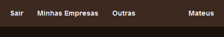
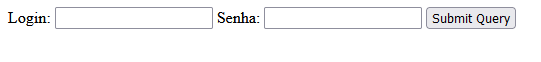
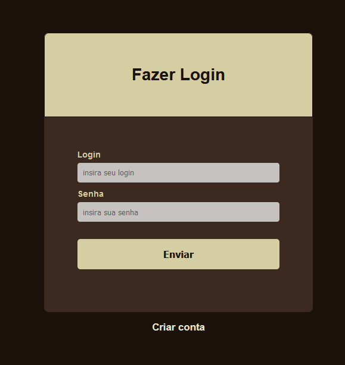
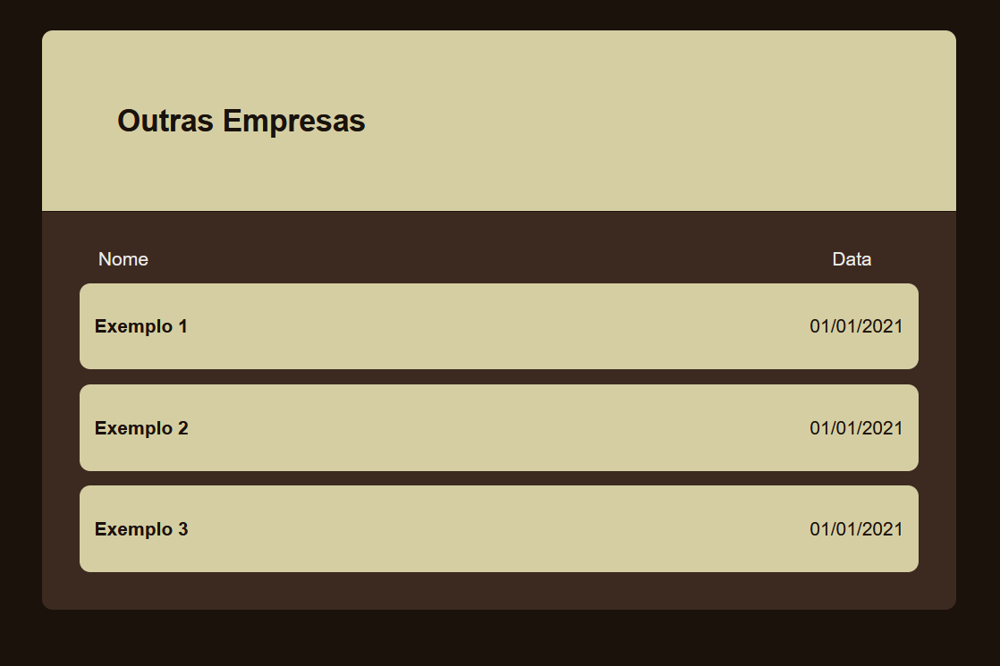
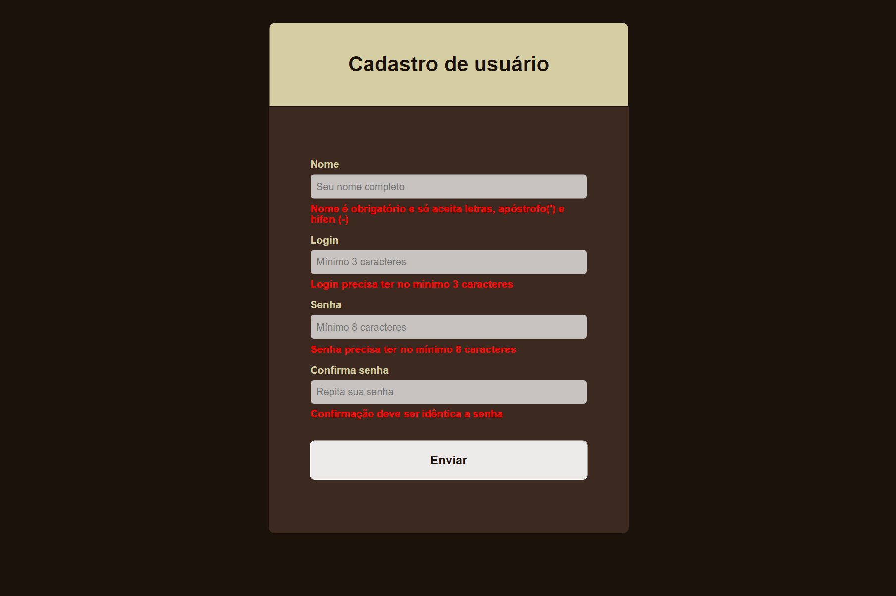

# Gerenciador de Empresas

Este projeto foi inicialmente criado como parte do curso 'Java Web: crie aplicações com Servlets e MVC' da Alura. A ideia aqui é desenvolver ainda mais essa aplicação colocando em prática minhas habilidades.

## Principais Melhorias

- Reestruturação de pacotes.
- Boas práticas.
- Maven.
- Estilização com CSS.
- Persistência com banco de dados relacional com JPA.
- Criptografia de senha.
- Relacionamento entre objetos.
- Implementação de Javascript para o front-end.
- Implementação de requisições assíncronas com AJAX.
- Migração da biblioteca javax-servlet para jakarta-servlet.
- Adição de Dockerfile e script shell para implantação em um contêiner.

 

## Mudanças visuais e funcionais

### Header

- Header com links para navegação.
- Modal com o nome do usuário logado e botão de logout usando ícones Font Awesome.

---
### Interface de Login

#### Antes:

#### Depois:

 
---
### Cadastro de Usuários

 
- Caso o usuário não tenha conta, agora ele pode se cadastrar.
 
---
### Home

#### Antes

 
Os elementos são adicionados através de um banco fictício. A página inicial permite apenas editar ou remover por completo.

#### Depois

 
 

- Os objetos Empresa possuem relacionamento com Usuario, permitindo que uma página mostre todas as empresas cadastradas na plataforma e outra página mostre apenas as empresas do Usuário.
- O Usuário só pode editar e remover empresas relacionadas consigo
- O Usuário consegue criar uma nova Empresa.
- As remoções agora não são mais deletes, são exclusões lógicas. Os botões remove/restaura quando clicados enviam uma requisição assíncrona que altera o status da Empresa.
---

### Tratamento das entradas nos formulários

- O formulário só será enviado quando todos os campos estiverem preenchidos corretamente. 
- Se o usuário inserir alguma informação que não esteja dentro do padrão que cada campo exige, surgirão mensagens de erro nos campos com problema.

## Como Executar

- Importe o projeto Maven
- Implante em um servidor Tomcat 10.1 com Java 17 ou superior
